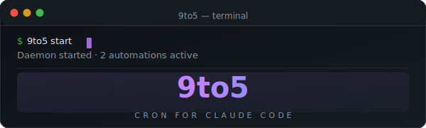
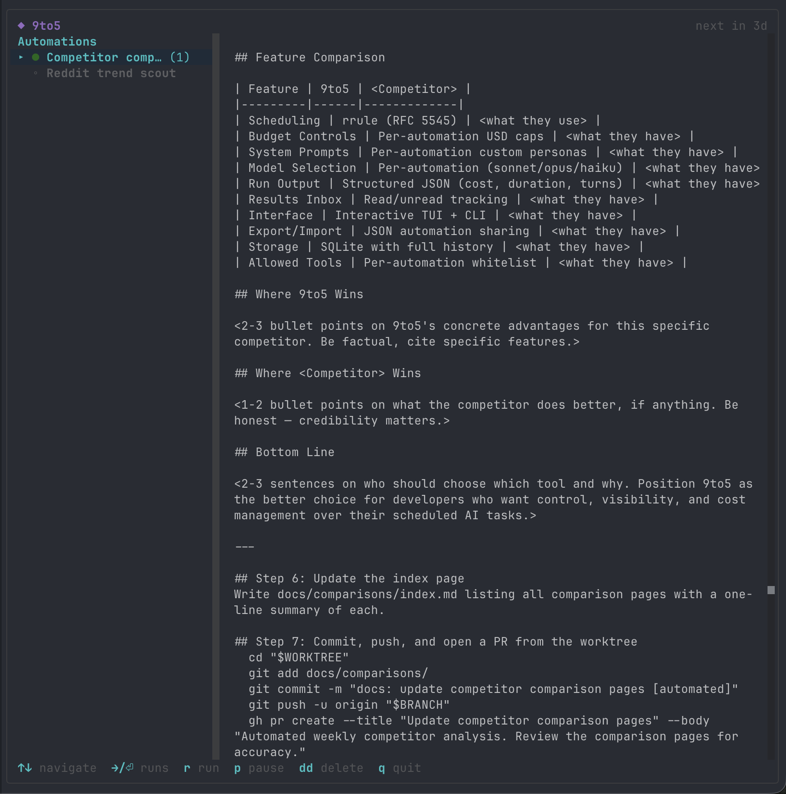
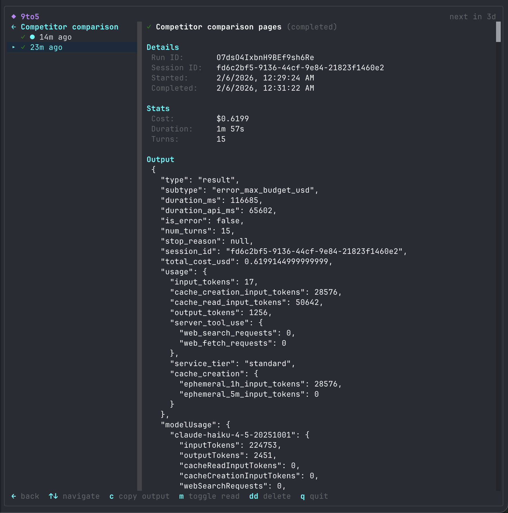

<p align="center">
  
</p>

<p align="center">
  A CLI tool to create and manage scheduled automations that run <a href="https://docs.anthropic.com/en/docs/claude-code">Claude Code</a> sessions on a timer.
</p> Claude Code does the actual work — reading files, running commands, opening PRs, writing code. 9to5 handles the when, how much, and keeps track of what happened.

<p align="center">
  
  
</p>

## Features

- **rrule scheduling** — RFC 5545 recurrence rules (daily, weekly, every 4 hours, etc.)
- **Per-automation budget caps** — set a max USD spend per run
- **Custom system prompts** — different personas for different tasks
- **Model selection** — choose sonnet, opus, or haiku per automation
- **Structured run output** — JSON parsing with cost, duration, and turn tracking
- **Inbox** — read/unread tracking for run results
- **Interactive TUI** — LazyGit-style dashboard with list + detail panels
- **Export/import** — share automations as JSON files
- **Background daemon** — polls and triggers runs on schedule

## Installation

Requires [Bun](https://bun.sh) (v1.1+) and [Claude Code](https://docs.anthropic.com/en/docs/claude-code) installed and authenticated.

```bash
git clone https://github.com/Michaelliv/9to5.git
cd 9to5
bun install
```

## Quick start

```bash
# Create an automation that runs daily at 9am
9to5 add "morning-review" \
  --prompt "Review yesterday's commits and summarize changes" \
  --rrule "FREQ=DAILY;BYHOUR=9" \
  --model sonnet \
  --max-budget-usd 0.25

# Run it immediately
9to5 run <id>

# Start the daemon for scheduled runs
9to5 start

# Launch the TUI dashboard
9to5 ui
```

## Commands

| Command | Description |
|---------|-------------|
| `9to5 add <name>` | Create a new automation |
| `9to5 edit <id>` | Edit an existing automation |
| `9to5 list` | List all automations |
| `9to5 remove <id>` | Delete an automation |
| `9to5 run <id>` | Trigger an automation immediately |
| `9to5 runs [id]` | View run history |
| `9to5 inbox` | View notifications from completed runs |
| `9to5 export [id]` | Export automation(s) as JSON |
| `9to5 import <file>` | Import automation(s) from JSON |
| `9to5 start` | Start the background daemon |
| `9to5 stop` | Stop the background daemon |
| `9to5 ui` | Launch the interactive TUI dashboard |

## TUI dashboard

Launch with `9to5 ui` for an interactive terminal dashboard:

- **Automations** — browse, run, pause, and delete automations with a detail panel showing prompt, schedule, and config
- **Runs** — drill into an automation to see execution history with status, duration, cost, and structured output
- **Hotkeys** — `r` run, `p` pause/resume, `dd` delete, `c` copy output, `m` toggle read, `q` quit

## Example automations

The [`examples/`](examples/) directory includes ready-to-import automations:

```bash
# Import any example
9to5 import examples/morning-briefing.json
```

| Example | Schedule | What it does |
|---------|----------|-------------|
| [Morning briefing](examples/morning-briefing.json) | Daily 7am | Summarize last 24h of commits, PRs, issues, CI status |
| [Test gap finder](examples/test-gap-finder.json) | Nightly | Find untested code in recent commits, suggest test skeletons |
| [Security scan](examples/security-scan.json) | Daily | Check recent commits for hardcoded secrets and vulnerability patterns |
| [TODO tracker](examples/todo-tracker.json) | Weekly | Inventory TODO/FIXME comments, track additions and removals |
| [Stale branch archaeologist](examples/stale-branch-archaeologist.json) | Weekly | Assess old branches and recommend which are safe to delete |
| [Dependency deep audit](examples/dependency-deep-audit.json) | Weekly | Analyze actual usage of deps, flag unmaintained or replaceable ones |
| [Refactor spotter](examples/refactor-spotter.json) | Weekly | Find emerging code patterns worth extracting |
| [API contract watchdog](examples/api-contract-watchdog.json) | Every 2h | Hit API endpoints, compare responses to spec, flag drift |
| [Ecosystem watch](examples/ecosystem-watch.json) | Every 12h | Check for new releases of dependencies and breaking changes |
| [Project health check](examples/project-health-check.json) | Every 6h | Run tests, measure build times, track repo metrics over time |
| [License compliance](examples/license-compliance-checker.json) | Weekly | Scan dependency tree for copyleft or problematic licenses |
| [Drift detector](examples/drift-detector.json) | Daily | Compare IaC config against actual running state |
| [Competitor comparison](examples/competitor-comparison-pages.json) | Weekly | Research competitors and generate comparison docs via worktree PR |
| [Reddit trend scout](examples/reddit-trend-scout.json) | Every 4h | Scout trending posts and draft blog content |

## Data

All data is stored locally in `~/.9to5/` (SQLite database and daemon PID file).

## Docs

Full documentation at [michaelliv.github.io/9to5](https://michaelliv.github.io/9to5/).

## License

MIT
